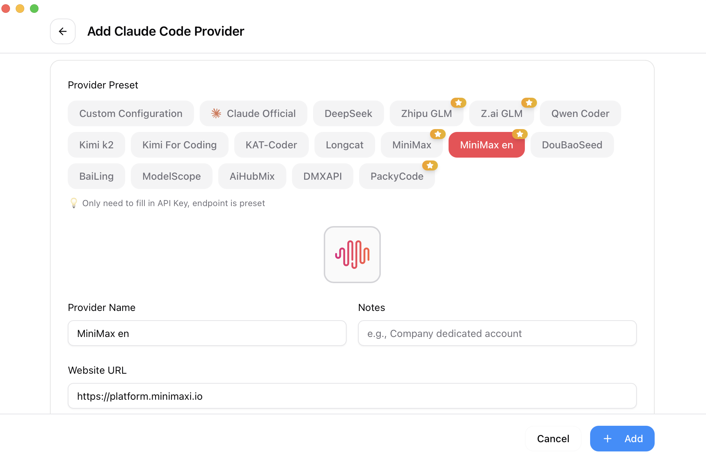

<div align="center">

# CC Switch Fork

English | [中文](README_ZH.md) | [日本語](README_JA.md)

This fork keeps the Web runtime as the only official GitHub Release deliverable.

</div>

## Scope

This fork is used for local customization and ongoing development. The current codebase provides:

- Configuration management for Claude Code, Codex, Gemini, OpenCode, and OpenClaw
- MCP, prompts, skills, proxy, failover, and usage-related features
- A single-binary Web runtime for official releases
- Tauri desktop code kept in-repo for local development only

## Screenshots

|                  Main Interface                   |                  Add Provider                  |
| :-----------------------------------------------: | :--------------------------------------------: |
|  |  |

## Official Release Assets

GitHub Releases publish the Web runtime only.

| Platform | Asset | Run |
| --- | --- | --- |
| Windows x86_64 | `cc-switch-web-v{version}-windows-x86_64.exe` | `./cc-switch-web-v{version}-windows-x86_64.exe` |
| Linux x86_64 | `cc-switch-web-v{version}-linux-x86_64-ubuntu20.04` | `chmod +x ./cc-switch-web-v{version}-linux-x86_64-ubuntu20.04 && ./cc-switch-web-v{version}-linux-x86_64-ubuntu20.04` |

### Runtime defaults

- URL: `http://127.0.0.1:17666`
- Port override: `CC_SWITCH_PORT=8080`
- Host override: `CC_SWITCH_HOST=0.0.0.0`
- Linux compatibility baseline: Ubuntu 20.04+

### Platform notes

- Windows: run the `.exe` directly in PowerShell or Command Prompt.
- Linux: official assets are built on Ubuntu 20.04 to keep the minimum supported baseline explicit.

### Docker + NGINX deployment

The Docker deployment follows the same local-backend / edge-proxy rule used by the 9router deployment:

- The container uses host networking so its managed local proxy can call configured local or remote provider upstreams directly; do not route production verification through the temporary `127.0.0.1:20128` test upstream.
- Web UI/API listens on `0.0.0.0:17666`; keep it reachable only through host firewall/WSL boundary and NGINX policy.
- The OpenAI-compatible local proxy listens on `0.0.0.0:15721`; OpenClaw uses `http://localhost:15721/v1`.
- External web access must go through NGINX, for example `0.0.0.0:30034 -> http://127.0.0.1:17666`.
- Do not publish Docker bridge ports as `0.0.0.0:17666:17666`; if bridge networking is restored, publish host loopback only.
- Persistent data is bind-mounted from the host: `/root/.cc-switch:/root/.cc-switch` stores the CC-Switch SQLite DB, providers, proxy config, settings, backups, and local verification provider state.
- OpenClaw config is mounted read-only: `/root/.openclaw:/root/.openclaw:ro`; CC-Switch may import providers but must not mutate OpenClaw's live config from this container.
- Before destructive rebuilds, migrations, or config experiments, back up `/root/.cc-switch` and `/root/.openclaw/openclaw.json` under `/home/win-files/openclaw-backups/ccs-gateway-web-data/`.

Build and start the local container:

```bash
stamp=$(date +%Y%m%d-%H%M%S)
backup_dir="/home/win-files/openclaw-backups/ccs-gateway-web-data/$stamp"
mkdir -p "$backup_dir/openclaw-config"
tar -czf "$backup_dir/root-cc-switch.tar.gz" -C /root .cc-switch
cp -a /root/.openclaw/openclaw.json "$backup_dir/openclaw-config/openclaw.json"

docker compose -f docker-compose.ccs-web.yml build
docker compose -f docker-compose.ccs-web.yml up -d
```

Expected smoke checks:

```bash
curl -fsS http://127.0.0.1:17666/health
curl -fsS http://127.0.0.1:15721/status
curl -sS http://127.0.0.1:15721/v1/responses \
  -H 'Content-Type: application/json' \
  -d '{"model":"gpt-5.5","input":[{"role":"user","content":"Return exactly: CCS_PING_OK"}],"max_output_tokens":32}'
curl -fsS http://127.0.0.1:30034/health
curl -s -o /dev/null -w '%{http_code}\n' http://127.0.0.1:30034/.env  # expected: 404
```

## Local Development

### Requirements

- Node.js 18+
- pnpm 8+ or npm
- Rust 1.85+
- Tauri CLI 2.8+ for desktop-only local development

### Common Commands

```bash
# Install dependencies
pnpm install

# Web development
pnpm dev:server
pnpm dev:web

# Type checking
pnpm typecheck

# Frontend unit tests
pnpm test:unit

# Build Web frontend (default build target)
pnpm build

# Desktop packaging when needed
pnpm build:desktop
```

### Local Web Launch

```bash
./start-web.sh
```

Then open:

```text
http://localhost:17666
```

Stop the service:

```bash
./stop-web.sh
```

Runtime files are written to `./.run/web/` by default:

- log: `backend.log`
- pid: `backend.pid`

To override the runtime directory:

```bash
CC_SWITCH_RUNTIME_DIR=/tmp/cc-switch-web ./start-web.sh
```

### Manual Web Build

```bash
pnpm build
cargo build --release --manifest-path crates/server/Cargo.toml
./crates/server/target/release/cc-switch-web
```

### Local Linux release-parity build

```bash
./build-web-release.sh
```

This script emits `release-web/cc-switch-web-v{version}-linux-x86_64-ubuntu20.04`.

### Release Workflow

Stage the changes you want in the release commit first, then run the helper:

```bash
git add <your-files>
pnpm release:cut -- 3.12.6 --push
```

The helper synchronizes these version files before commit and tag creation:

- `package.json`
- `src-tauri/Cargo.toml`
- `src-tauri/tauri.conf.json`

To update version fields only:

```bash
pnpm release:sync-version -- 3.12.6
```

## Tech Stack

- Frontend: React 18, TypeScript, Vite, TailwindCSS, TanStack Query
- Backend: Tauri 2, Rust, tokio, serde
- Testing: vitest, MSW, @testing-library/react

## Project Layout

```text
src/                 frontend code
src-tauri/           Tauri desktop backend
crates/server/       web server
crates/core/         shared core logic
tests/               frontend tests
assets/              screenshots and assets
docs/                supplementary documentation
```

## License

See [LICENSE](LICENSE).
